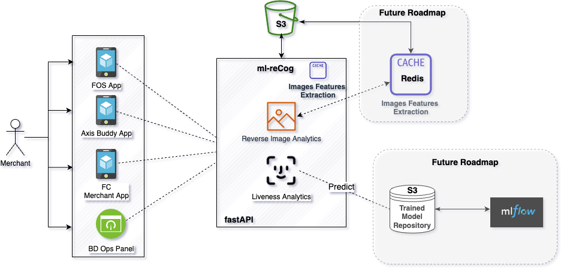

# ml-reCog
***

### Table of Contents
- Introduction
- Architecture
- Libraries Used

***
### Introduction
SaaS product which does liveness detection and reverse image search

---
### Architecture

---

### Libraries Used
1. Numpy - BSD License
2. Keras - Apache License
3. Face_recognition - MIT License
4. Opencv-python - MIT License
5. Fastapi - MIT
6. Uvicorn - BSD clause-3
7. Python-multipart - Apache Software
